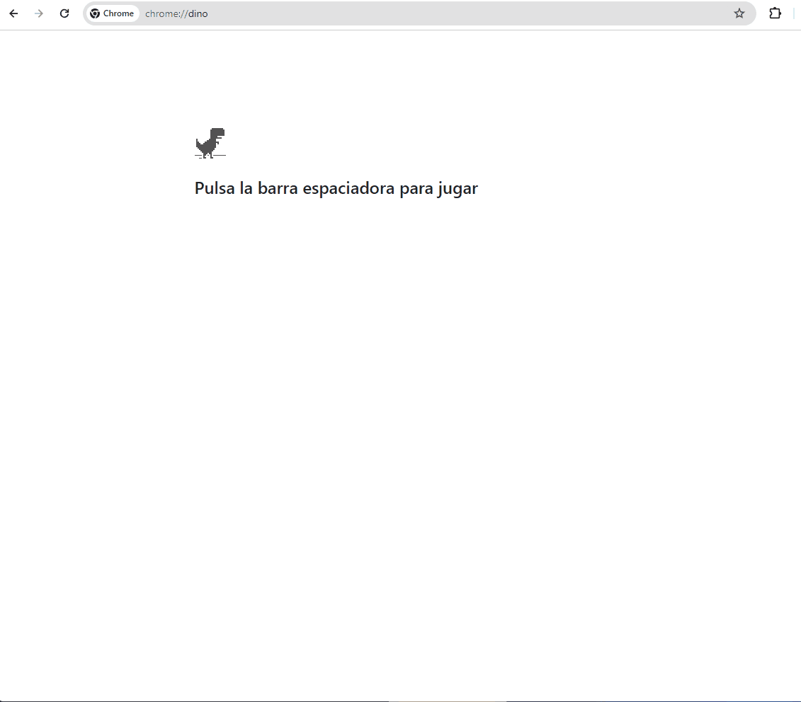

# Examen Final Ordinario - Despliegue de Aplicaciones Web

### Datos del alumno

- Nombre alumno:
- Curso:
- Fecha:
- Evaluación:

## Ejercicio 1 (10 Ptos)

Este ejercicio consiste en preparar para despliegue una Aplicación Web realizada en PHP. La aplicación es un Classroom, realizado con PHP, que se conecta a una base de datos MySQL.

Pero antes de poder desplegar, es necesario poder probar nuestra aplicación en local. Por ello los pasos a seguir son los siguientes:

- Crear una configuración de carpetas adecuada para el proyecto, que contenga el código fuente de la aplicación, así como los ficheros de configuración necesarios.
- Probar la aplicación en local con Docker. (A través de docker-compose)

<br>
<hr>

<details>
  <summary><p style="display:inline;font-size:14px">Previsualización página</p></summary>
  <br>
    
</details>
<hr>

### Partes del ejercicio

#### Aplicación Web PHP

Se está desarrollando una aplicación web PHP, para un blog. Esta aplicación almacenará los datos en una base de datos MySQL.

El código fuente de la aplicación se encuentra disponible en el siguiente [enlace](https://drive.google.com/file/d/1u4DvOAZSAHts159ON6s9uDuFB-thCy-t/view?usp=sharing)

La aplicación requiere de una BD MySQL, cuya configuración de acceso se configure en el archivo `database.php`, **se requiere cambiar esta configuración, tanto `nombre-servidor`, `usuario`, `contraseña` y `nombre-base-datos`**, según los datos de acceso a la base de datos que se configuren.

#### Nginx-PHP

Para poder probar la aplicación en local, se va a utilizar una imagen de Docker que ya tiene configurado un servidor web Nginx y el servidor de aplicaciones PHP-FPM.

La confgiuración de Nginx por defecto (solo existe este servidor) es la que se indica en el siguiente fichero:

```nginx
# pass https on for Laravel isSecure/asset
map $http_x_forwarded_proto $fastcgi_param_https_variable {
    default '';
    https 'on';
}

server {
    listen       80; #ipv4
    server_name   _; # cualquier dominio

    root   /var/www/html/public;

    if ($request_method = POST) {
        set $skip_cache 1;
    }

    client_max_body_size 5M;

    location / {
        try_files $uri $uri/ $uri.php;

        # Client IP Handling for AWS ELB
        proxy_set_header X-Real-IP $remote_addr;
        proxy_set_header X-Forwarded-For $proxy_add_x_forwarded_for;
        proxy_set_header X-Forwarded-Proto $scheme;
    }

    location ~ \.php$ {
        root /var/www/html/public;

        fastcgi_cache dwchiang;
        fastcgi_cache_valid 200 204 60m;
        fastcgi_ignore_headers Cache-Control;
        fastcgi_no_cache $skip_cache $http_authorization $cookie_laravel_session;
        fastcgi_cache_lock on;
        fastcgi_cache_lock_timeout 10s;
        fastcgi_buffer_size 6144;

        add_header X-Proxy-Cache $upstream_cache_status;

        fastcgi_pass            127.0.0.1:9000;
        fastcgi_index           index.php;
        fastcgi_param           SCRIPT_FILENAME $document_root$fastcgi_script_name;
        fastcgi_param           HTTPS $fastcgi_param_https_variable;
        fastcgi_read_timeout    900s;
        include                 fastcgi_params;
    }

    location ~* \.(jpg|jpeg|png|gif|ico|css|js|eot|ttf|woff|woff2)$ {
        expires max;
        add_header Cache-Control public;
        add_header Access-Control-Allow-Origin *;
        access_log off;
        try_files $uri $uri/ /index.php?$query_string;
    }

    location ~ /\.ht {
        deny all;
    }
}
```

#### Docker

Para poder probar la aplicación en local, se va a utilizar un fichero docker-compose que levante dos contenedores, uno con la aplicación web y otro con la base de datos MySQL.

#### Docker-compose

Se dispone de un fichero `docker-compose.yml` base que hay que configurar con la configuración específica para este caso.

1. Dispone de 2 servicios, uno para la aplicación web y otro para la base de datos MySQL.

   1. Servcio `www`:

      - Se basa en la imagen `jssdocente/nginx-php-fpm:8.2`, que ya tiene configurado un servidor web Nginx y el servidor de aplicaciones PHP-FPM.
      - El servicio web esucha por el puerto 80, y se debe acceder a través de `http://localhost`.
      - El servicio web debe montar un directorio `app` que contiene el código fuente de la Web, en la ruta adecuada según se indica en la configuración de Nginx (indicada anteriormente).
      - La configuración de Nginx indicada se debe montar también para que se aplique, en la ubicación/nombre-archivo adecuada.

   2. Servicio `db`:

      - Se basa en la imagen `mysql:8.0`.
      - El puerto interno de la base de datos es el 3306, pero para evitar conflictos con una posible base de datos MySQL que se esté ejecutando en el equipo, se debe utilizar de forma externa el puerto `3390`.
      - El nombre de la BD, así como el usuario y contraseña, se indican en el fichero `docker-compose.yml` como variables de entorno.
      - El nombre del servidor de BD es el nombre del servicio `db`.
      - La variables de entorno `MYSQL_ALLOW_EMPTY_PASSWORD`:`yes` indica que el usuario `root` no tiene contraseña. (_Para conocer el significada de cada variable de entorno, consulta la documentación de la imagen de MySQL en DockerHub_)

      - Para almacenar los datos de la base de datos, se ha creado un volumen `evford_dbdata`. Se debe mapear el volumen a la ruta `/var/lib/mysql` del contenedor.
      - Para inicializar la base de datos, se debe montar un directorio `init` que contiene los scripts de inicialización de la base de datos, en la ruta `/docker-entrypoint-initdb.d` del contenedor.
        Los datos de inicialización deben estar ubicados en el directorio `conf/db/init/` de la estructura de carpetas del proyecto. El script de inicialización se debe llamar `init.sql`. (Este script está disponible en la carpeta `Database\cc_db.sql` del código fuente de la App)

```yaml
version: "3.8"
name: exevalford
services:
  www:
    image: jssdocente/nginx-php-fpm:8.2
    container_name: evford-nginx
    # ... completa la configuración del servicio www

  db:
    image: mysql:8.0
    container_name:
      evford-mysql-8.0
      # ... completa la configuración del servicio www

    command: --default-authentication-plugin=mysql_native_password
    environment:
      MYSQL_DATABASE: myclassroom
      MYSQL_USER: examen
      MYSQL_PASSWORD: examen
      MYSQL_ALLOW_EMPTY_PASSWORD: "yes"
    volumes:
      - ./conf/db/init:/docker-entrypoint-initdb.d

volumes:
  evford_dbdata:
    driver: local
```

### Pasos de la tarea

- [x] 1.1 Crear la estructura de carpetas para probar la aplicación en local
- [x] 1.2.1a Crear el fichero docker-compose y explicación del mismo, para probar la aplicación en local.
- [x] 1.2.1b Conexión a la BD desde MySQL Workbench, mostrando la estructura de la BD, y los datos de las tablas `admin`, `facutlytable` y `studenttable`.
- [x] 1.2.2 Aplicación Web funcionando a través de `localhost`
- [x] 1.2.3 Modifica el fichero de configuración de Nginx para que se pueda acceder por el dominio `myclassroom.local` y `www.myclassroom.local` .
- [x] 1.2.4 Accede a la Aplicación con un usuario Admin
- [x] 1.2.5 Accede a la Aplicación con un usuario Faculty
- [x] 1.2.6 Accede a la Aplicación con un usuario Student
- [x] 1.2.7 Páginas de error 403 y 404
- [x] 1.2.8 Modificación configuración Nginx solucionar problema 403 Forbidden
- [x] 1.2.9 Eliminar escenario docker-compose
- [x] 1.2.10 Crear imagen Docker de la aplicación a partir del fichero `Dockerfile`
- [x] 1.2.11 Probar funcionamiento a partir de la imagen creada
- [x] 1.2.12 Subir a dockerhub la imagen creada

### Partes a entregar

#### 1.1 Estructura de carpetas

Se debe crear una estructura de carpetas adecuada para el proyecto, que contenga el código fuente de la aplicación, así como los ficheros de configuración necesarios, tanto para probar probar la configuración, como para empaquetar para el despliegue.

> 📄 Explica cada una de las carpetas y archivos, indicando que funcionalidad tiene, qué ficheros se van a alojar en ella, explicando para cada uno de ellos su función/utilidad.

> 🧲 Captura de la estructura de carpetas, donde se visualize claramente el nombre de las carpetas y archivos.

#### 1.2.1 Entrega de la configuración de docker-compose

Comenta las líneas del fichero `docker-compose.yml` que has incluiudos, indicando qué hace cada línea, a través de un comentario en el propio fichero.

> 🧲 Incluye aquí una captura de pantalla del fichero docker-compose.yml con todas las partes necesarias rellenas.

> 🧲 Incluye un GIF con la ejecución del comando `docker compose up`

> 🧲 Incluye un GIF donde se visulize la conexión desde _MySQL Workbench_ a la BD. Muestra la estructura de la BD, mostrando la estructura de la BD, y los datos de las tablas `admin`, `facutlytable` y `studenttable`.

#### 1.2.2 Entrega Aplicación Web funcionando

> 🧲 Incluye un GIF con la ejecución de la aplicación web a través de `localhost`. Accede a la misma a través del Navegador. `http://localhost/index.php`

#### 1.2.3 Modifica configuración Nginx

Ahora realiza los cambios necesarios en la configuración de Nginx, para que esta web se pueda acceder a través del dominio `myclassroom.local` y `www.myclassroom.local`.<br>
Usar para esto el fichero de configuración `default.conf`, **no hace falta crear un nuevo fichero**.

> 📄 Explica qué has cambiado en la configuración de Nginx

> 🧲 Captura pantalla configuración Nginx donde se resalte el cambio realizado

#### 1.2.4 Accede a la Aplicación con un usuario Admin

Los usuarios Administradores, están en la tabla `admin` de la base de datos. Accede a la aplicación con un usuario Admin.

> 📄 Indica las credenciales de un usuario Admin

> 🧲 Adjunta GIF donde se visualize login, entrar en algunas opciones, y después Logout.

#### 1.2.5 Accede a la Aplicación con un usuario Faculty

Los usuarios Administradores, están en la tabla `facutlytable` de la base de datos. Accede a la aplicación con un usuario Admin.

> 📄 Indica las credenciales de un usuario Facultad

> 🧲 Adjunta GIF donde se visualize login, entrar en algunas opciones, y después Logout.

#### 1.2.6 Accede a la Aplicación con un usuario Student

Los usuarios Administradores, están en la tabla `studenttable` de la base de datos. Accede a la aplicación con un usuario Admin.

> 📄 Indica las credenciales de un usuario Student

> 🧲 Adjunta GIF donde se visualize login, entrar en algunas opciones, y después Logout.

#### 1.2.7 Páginas de error 403 y 404

Crea las páginas siguientes:

- 404.html. Página simple con un h1 que diga `Página no encontrada`.
- 403.html. Página simple con un h1 que diga `No tienes permiso para acceder a este recurso`.

Modifica la configuración de Nginx para que si se produce un error 404, se muestre la página `404.html`, y si se produce un error 403, se muestre la página `403.html`.

Ahora si accedes `myclassroom.local` se debe mostrar la página `403.html` personaliza que acabas de craer.

> 📄 Explica qué has cambiado en la configuración y explica el motivo.

> 🧲 Incluye un GIF donde se visualize que al acceder `myclassroom.local` se muestra la página `403.html`

#### 1.2.8 Modifica configuración Nginx

Si accedes a `localhost` o `myclassroom.local` verás que obtienes una página `403 Forbidden`. Corrige la configuración de Nginx para que se pueda acceder a la aplicación sin especificar una página.

> 📄 Explica qué has cambiado en la configuración y explica el motivo.

> 🧲 Incluye un GIF donde se visualize que se puede acceder por `myclassroom.local` y se accede a la web.

#### 1.2.9 Eliminar escenario docker-compose

Elimina los contenedores del escenario creado a través de una orden, también que se elimine el volumen.

> 📄 Indica la orden que has utilizado

#### 1.2.10 Crear imagen Docker de la aplicación

Crea un fichero `dockerfile` que permita crear una imagen Docker de la aplicación. Crear dentro de la carpeta `src`<br>
**Nombre la imagen `{usuario-dockerhub}/myclassroom:1.0`.**

> 📄 Adjunta el texto del dockerfile en un bloque de código

```dockerfile
# contenido del dockerfile
```

> 🧲 Incluye un GIF donde se visualize la creación de la imagen a partir del dockerfile.

#### 1.2.11 Probar funcionamiento a partir de la imagen creada

Ahora levanta un contenedor a partir de la imagen creada, y comprueba que la aplicación funciona correctamente, igual que antes.

> 🧲 Incluye un GIF donde se visualize que la aplicación funciona a través de la imagen creada.

#### 1.2.12 Subir a dockerhub la imagen creada

Sube la image creada a dockerhub, a través de comando.

> 📄 Indica el comando que has utilizado

> 🧲 Incluye una imagen con la imagen docker subida a tu repositorio de dockerhub

<br>
<hr>
<br>
